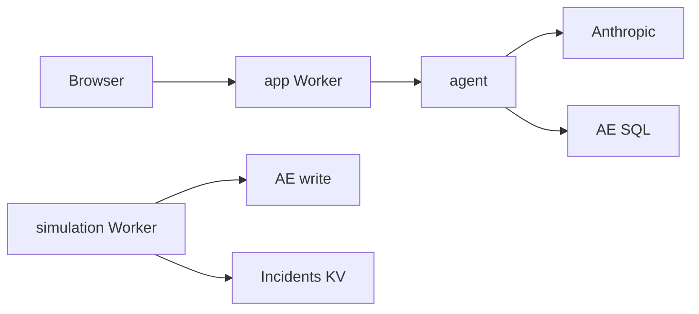

# Tracehound

**Live agent:** https://tracehound.shree6791.workers.dev  
**Repo:** https://github.com/shree6791/tracehound  
**Simulation (cron / optional curl):** https://tracehound-simulation.shree6791.workers.dev

An agentic investigator for a simulated checkout system. Ask “what’s broken?” — it queries Cloudflare Analytics Engine, correlates errors with latency, and reports what’s failing, since when, and why.

---

## What it does

- Minute cron injects short-lived incidents and fires synthetic checkouts into AE dataset `tracehound_analytics`
- Chat UI → `POST /investigate` → Claude tool loop (`fetch_errors`, `fetch_latency`, `service_signals`)
- Returns a short answer: broken service + failure mode, approximate start, likely cause
- Optional Sentry on simulation errors (human alerts; not used by the agent)

---

## How it works

```
api-gateway → order-service → payment-service → inventory-service
```

| Piece | Role |
|---|---|
| `simulation/` (Python Worker) | Cron every minute: ~20% chance of a **5‑min** incident (one service + one mode); **3–7** synthetic checkouts write AE spans (+ optional Sentry). `POST /checkout` for manual curl only. |
| `app/` (TS Worker) | Serves React UI assets; `GET /health`, `POST /investigate` only (no checkout proxy) |
| `agent/` (TS library) | Anthropic tool loop imported by `app/` — not a separate deploy |
| `frontend/` | Vite + React chat UI (browser only talks to `/investigate`) |



Failure modes: `latency_spike` (slow only), `error_burst` (errors), `cascading_timeout` (slow + errors). Span `duration_ms` is a **stamped metric** for AE (no real sleep); it does not extend the 5‑min incident window.

Config is single-sourced in `shared/config.json` (`npm run sync-config`).

---

## Decisions & tradeoffs

- **All on Cloudflare** — no separate agent host; matches the “build on the edge” constraint and keeps deploy simple.
- **Hand-rolled tool loop, not LangGraph** — LangGraph exceeded free-tier Worker size; a thin loop keeps the same tool-calling shape and stays deployable.
- **Two Workers (TS + Python)** — Python for KV / AE write binding / cron; TypeScript for UI + Anthropic + AE SQL reads (write binding is write-only).
- **No app→sim service binding** — UI never checkouts; traffic is cron-driven (curl the simulation Worker directly if needed).
- **Soft investigate deadline (~22s, 5 iters)** — free-tier wall-clock can kill long runs; return a partial answer instead of a hard failure.
- **Simulator-aware prompts** — one active incident, ~5‑min windows, canned error strings; avoid inventing real DB/deploy narratives.

---

## With more time

- Workers Paid (or streaming) for longer, multi-round investigations
- Chat follow-up history across UI turns (today each Submit is one-shot)
- Isolated staging KV / AE datasets (staging currently shares prod IDs)
- Stronger evals: gold incidents vs agent answers, not just SQL unit tests
- Richer tools (per-minute buckets, active-incident debug mode for demos)
- External uptime checks on `/health` (Sentry is already wired on the simulation Worker)

---

## Quick start

```bash
npm ci
npm run deploy          # sync config → simulation → app (+ UI)
```

Secrets (once): `ANTHROPIC_API_KEY`, `CF_ANALYTICS_TOKEN` on `app/`; optional `SENTRY_DSN` on `simulation/`.

```bash
npm run ci              # drift check + tests + typecheck + UI build
npm run smoke:ae        # live AE SQL
npm run check:health
# optional manual checkout:
curl -X POST https://tracehound-simulation.shree6791.workers.dev/checkout
```

Local: `cd simulation && uv run pywrangler dev` and `cd app && npm run dev` (see `.dev.vars.example`).
